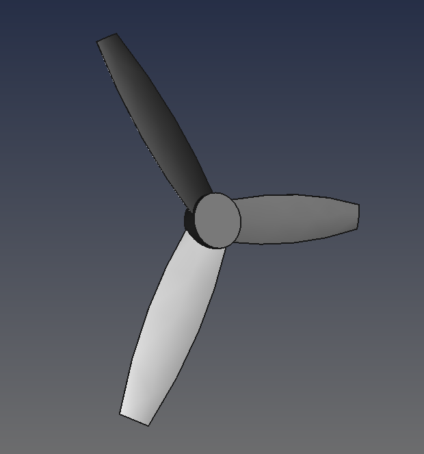
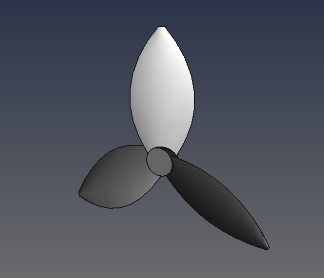
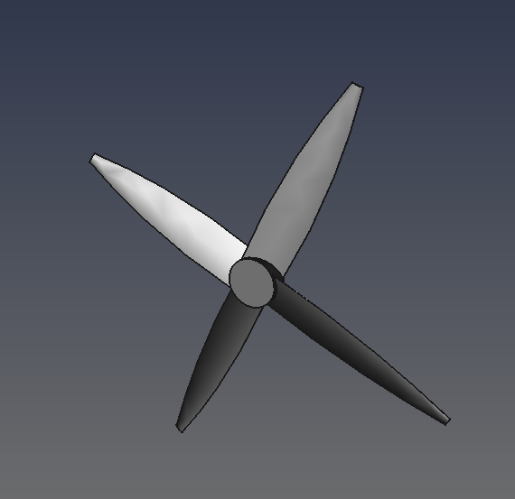
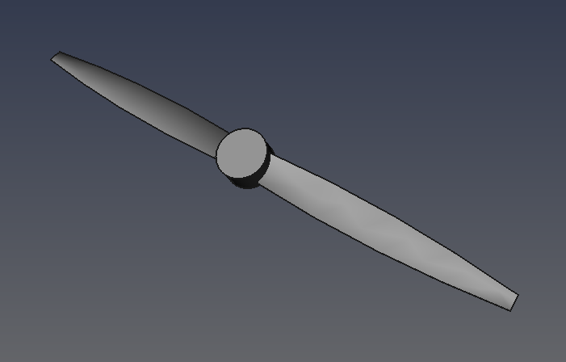

# Parametric Propeller Design in FreeCAD

This FreeCAD file generates a customizable 3D propeller model based on parametric values defined in a spreadsheet. 
By modifying specific parameters in the spreadsheet, users can adjust the propeller’s geometry, including blade count, diameter, length and angles.

## File Structure

- **Propeller_CAD.FCStd**: The main FreeCAD file containing the propeller model.
- **Spreadsheet**: Embedded within the FreeCAD file.

## How to Use

1. Open **Propeller_CAD.FCStd** in FreeCAD.
2. Access the **Spreadsheet** (found in the model tree) and modify desired parameters.
3. It should automatically recompute, if not: Save the file to apply changes, then recompute the model (`Ctrl+R` or **Edit > Refresh**).
4. Export or further modify as needed.

Note: Some parameter combinations may result in geometries that FreeCAD cannot resolve. There are no specific rules for which values work best, so you may need to experiment with different settings to achieve a valid model.

## Examples

## Requirements

- **FreeCAD** (v0.19 or later recommended)

